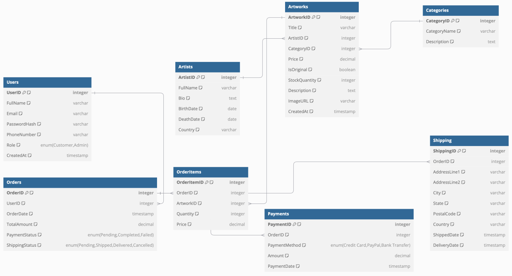

# ARTS Database Design and ETL Process

Content:

1. [Project Structure](#Project-Structure)
2. [Database Overview](#Database-Overview)
3. [How to Run](#run)

## 1. Project Structure 

### 1. OLTP (Operational Database)
The **OLTP** database manages day-to-day transactions such as user registrations, orders, payments, and shipping.

### 2. OLAP (Analytical Database)
The **OLAP** database supports business intelligence and analytical queries, enabling insights like top-selling artists, sales trends, and customer behavior.

---

## 2. Database Overview 

### 1. Database Creation

The **ARTS** database is designed to support an e-commerce platform specializing in artworks. It includes functionality to manage:

- **`Users:`** Customers and administrators.
- **`Artists:`** Detailed artist information.
- **`Categories:`** Classification of artworks.
- **`Artworks:`** Inventory and pricing of artworks.
- **`Orders` and `Payments:`** Order processing and payment tracking.
- **`Shipping:`** Delivery and logistics management.

---

### 2. Enum

To ensure consistency, the following enumerated types (enums) are defined:

- **`user_role:`** 'Customer', 'Admin'
- **`payment_status:`** 'Pending', 'Completed', 'Failed'
- **`shipping_status:`** 'Pending', 'Shipped', 'Delivered', 'Cancelled'
- **`payment_method:`** 'Credit Card', 'PayPal', 'Bank Transfer'

---

### 3. Database Tables

The database schema consists of the following tables:

- **`Users:`** Stores details of customers and administrators.
- **`Artists:`** Contains artist profiles, biographies, and origins.
- **`Categories:`** Organizes artworks into distinct groups.
- **`Artworks:`** Manages artwork inventory, pricing, and descriptions.
- **`Orders:`** Tracks customer orders and their statuses.
- **`OrderItems:`** Details individual items within orders.
- **`Payments:`** Logs payment transactions and methods.
- **`Shipping:`** Records shipping details and delivery progress.

---

This structure ensures efficient management of all core features required for an art-centric e-commerce platform.

## 3. How to Run 
#### Prerequisites:
1. PostgreSQL installed and configured.
2. dblink extension enabled in your PostgreSQL instance.

### Steps
1. Create the OLTP Database:
Run the provided SQL script to create the ARTS database and its schema.

2. Load Data into OLTP:
Place CSV files in the data/ folder.
Use the ETL scripts to populate the ARTS database.

3. Create the OLAP Database: Run the provided script to create the arts_analytics database and its schema.
4. Transfer Data to OLAP:
Execute the data transfer scripts using dblink.
5. Run Queries:
Use the provided OLTP and OLAP query examples to generate insights.
